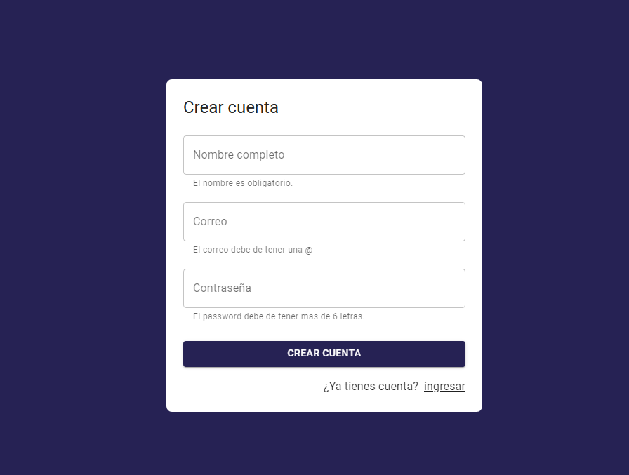
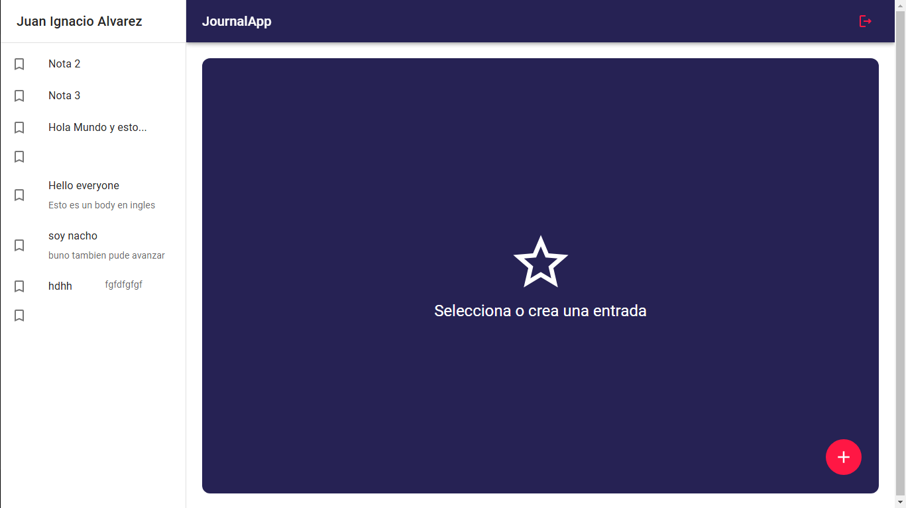
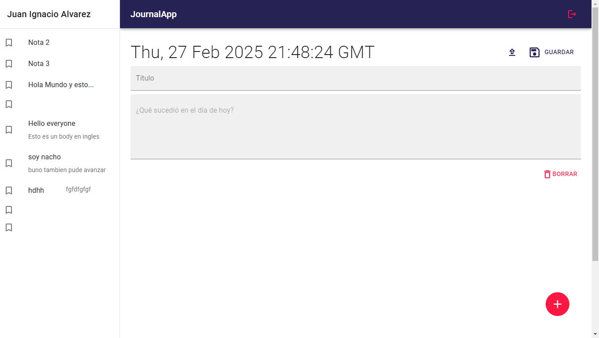

# Journal-App

Journal-App es una aplicación de notas creada con **React**, **Vite**, y diversas herramientas modernas como **Firebase**, **Cloudinary** y **Google Auth**. Esta aplicación permite a los usuarios escribir, editar y organizar sus notas en un entorno seguro y rápido.

### Características principales
- **Rendimiento rápido** ⚡: La aplicación está optimizada para ofrecer una experiencia ágil gracias a **Vite**.
  
- **Autenticación con Google** 🧑‍💻: Los usuarios pueden iniciar sesión con su cuenta de Google de manera rápida y segura.
  
- **Almacenamiento de datos** ☁️: Las notas se almacenan en **Firebase**, lo que asegura que estén disponibles en todo momento y en cualquier dispositivo.

- **Gestión de imágenes** 🖼️: Las imágenes pueden ser cargadas y gestionadas utilizando **Cloudinary** para un almacenamiento eficiente.
  

### Tecnologías usadas
- **React**: Para crear la interfaz de usuario interactiva.
- **Vite**: Herramienta de desarrollo que permite una configuración rápida y eficiente del entorno.
- **Firebase**: Para almacenamiento en la nube y autenticación de usuarios.
- **Cloudinary**: Para la gestión de imágenes.
- **Google Auth**: Para iniciar sesión mediante cuentas de Google.
